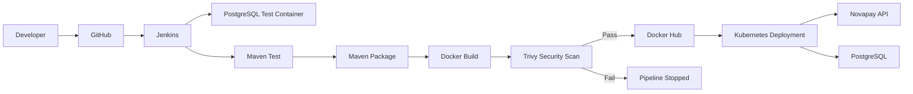
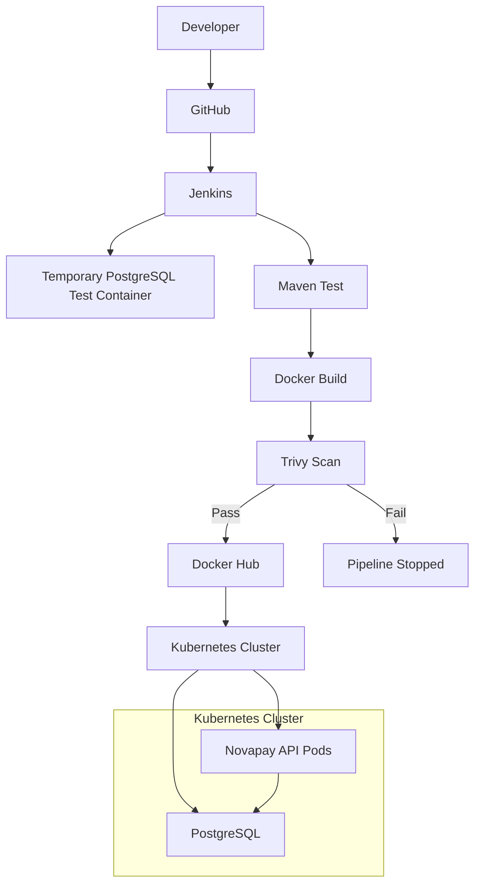

# Novapay DevSecOps


> An end-to-end **DevSecOps CI/CD pipeline** built around a Spring Boot + PostgreSQL API — covering AWS infrastructure, Docker, Jenkins automation, container vulnerability scanning, and Kubernetes deployment.

This repository is not just an application — it is a demonstration of a **complete software delivery lifecycle**: from a developer pushing code, through automated testing and security gating, to a running deployment on Kubernetes. The focus of this project is the infrastructure, automation, and security tooling around the application, not the application code itself.

---

## Table of Contents

1. [Project Overview](#1-project-overview)
2. [Technologies Used](#2-technologies-used)
3. [Project Evolution](#3-project-evolution)
4. [CI/CD Pipeline](#4-cicd-pipeline)
5. [DevSecOps Security Implementation](#5-devsecops-security-implementation)
6. [Dockerfile](#6-dockerfile)
7. [Kubernetes Architecture](#7-kubernetes-architecture)
8. [Current Kubernetes Status](#8-current-kubernetes-status)
9. [Docker Compose](#9-docker-compose)
10. [Project Structure](#10-project-structure)
11. [Jenkinsfile](#11-jenkinsfile)
12. [Challenges & Solutions](#12-challenges--solutions)
13. [DevSecOps Principles Demonstrated](#13-devsecops-principles-demonstrated)
14. [How to Run Locally](#14-how-to-run-locally)
15. [Security Best Practices](#15-security-best-practices)
16. [Architecture Diagram](#16-architecture-diagram)
17. [Key Learning Outcomes](#17-key-learning-outcomes)
18. [Why This Project Matters](#18-why-this-project-matters)
19. [Author / Connect](#19-author--connect)

---

## 1. Project Overview

**Novapay** is a Spring Boot REST API backed by PostgreSQL. While the application itself is intentionally simple, the project's real purpose is to demonstrate the **evolution of a delivery pipeline** — starting from a manually deployed AWS environment and progressing into a fully automated, security-integrated CI/CD workflow.

The current automated pipeline covers:

```
GitHub → Jenkins → Testing → Packaging → Docker Build → Trivy Security Scan → Docker Hub → Kubernetes Deployment
```

A core design goal of this project is that **security is not a separate, manual afterthought** — it is embedded directly into the CI/CD pipeline as an automated gate that can block a release if vulnerabilities are found.

---

## 2. Technologies Used

### Application

| Technology | Purpose |
|---|---|
| Java 21 | Application runtime |
| Spring Boot | REST API framework |
| Maven | Build and dependency management |
| PostgreSQL | Relational database |

### DevOps / CI/CD

| Technology | Purpose |
|---|---|
| Git | Version control |
| GitHub | Source code hosting |
| Jenkins | CI/CD automation server |
| Docker | Containerization |
| Docker Compose | Local multi-container orchestration |
| Docker Hub | Container image registry |

### DevSecOps

| Technology | Purpose |
|---|---|
| Trivy | Container image vulnerability scanning |
| Security gates | Fail the pipeline on HIGH/CRITICAL findings |

### Kubernetes

| Resource | Purpose |
|---|---|
| Deployment | Manages application pod replicas |
| Service | Exposes pods on the network |
| ConfigMap | Non-sensitive configuration |
| Secret | Sensitive credentials |
| PersistentVolumeClaim | Durable storage for PostgreSQL |
| Horizontal Pod Autoscaler | Scales replicas based on utilization |

### Cloud / Infrastructure

| Technology | Purpose |
|---|---|
| AWS | Cloud provider used for the initial deployment phase |
| EC2 | Virtual machine hosting |
| Linux | Server administration |
| SSH | Remote server access |
| VPC / Subnets | Network isolation |
| Route Tables | Network traffic routing |
| Internet Gateway | Public internet access |
| Security Groups | Firewall rules |

---

## 3. Project Evolution

This project did not start as an automated pipeline — it evolved through four distinct phases, each building on the previous one.

### Phase 1 — AWS Deployment

The application was first deployed and tested manually in an AWS environment:

```
AWS → EC2 → Linux → Docker → Novapay Application
```

This phase provided hands-on experience with:

- Provisioning and configuring an EC2 instance
- Linux server administration
- Connecting via SSH
- Installing Docker on a Linux host
- Manually deploying and running the application container
- Core AWS networking: VPC, Subnets, Route Tables, Internet Gateway, and Security Groups

> **Note:** This manual AWS deployment represents an early phase of the project. The current Kubernetes deployment described later in this README is **not** running on AWS or EKS unless explicitly stated otherwise.

### Phase 2 — Containerization

The application was containerized using Docker, replacing manual JAR execution with a portable, reproducible image that could run consistently across environments.

### Phase 3 — Kubernetes

The application and PostgreSQL were migrated from a single Docker host to Kubernetes, using declarative YAML manifests for Deployments, Services, ConfigMaps, Secrets, and persistent storage.

### Phase 4 — DevSecOps Automation

Jenkins was introduced to remove manual steps entirely and automate the full workflow:

```
GitHub → Jenkins → Test → Build → Security Scan → Push → Kubernetes Deployment
```

This progression — manual AWS deployment → containerization → Kubernetes → full CI/CD automation — reflects the natural maturity path of a real-world DevOps initiative.

---

## 4. CI/CD Pipeline



### Stage 1 — Checkout

Jenkins retrieves the latest source code from the connected GitHub repository, marking the start of every pipeline run.

### Stage 2 — Start PostgreSQL

Jenkins starts a temporary PostgreSQL Docker container purely for automated testing. This container is attached to a dedicated Docker network, `novapay-ci-network`, so the test suite can reach it in isolation from other containers. Jenkins polls the container using `pg_isready` and waits until PostgreSQL reports `accepting connections` before proceeding.

### Stage 3 — Maven Test

The Maven test suite runs inside a Maven Docker container. The container is executed using the Jenkins user's UID/GID so that any files generated during the build (such as compiled classes or test reports) are owned by the Jenkins user rather than `root`. A writable Maven repository is also mounted into the container so dependencies can be downloaded and cached without permission errors.

### Stage 4 — Maven Package

Once tests pass, the application is packaged with:

```bash
./mvnw clean package -DskipTests
```

Tests are skipped at this stage since they were already executed and validated in Stage 3 — this stage exists purely to produce the deployable JAR.

### Stage 5 — Docker Image Build

The application image is built from the project's Dockerfile, targeting the `linux/arm64` platform. The image is based on `eclipse-temurin:21-jre-alpine` for a small, JRE-only runtime footprint.

### Stage 6 — Trivy Security Scan

Trivy scans the freshly built image for known vulnerabilities. The Jenkins security gate is configured to fail the build on `HIGH` and `CRITICAL` findings. This makes Trivy a genuine **security gate** — the image cannot reach Docker Hub unless it passes this check.

### Stage 7 — Docker Hub Push

Only after passing the Trivy scan is the image pushed to Docker Hub, authenticated using Jenkins-managed credentials. No credentials, tokens, or passwords are stored in the repository or the Jenkinsfile itself.

### Stage 8 — Kubernetes Deployment

On a successful pipeline run, Jenkins automatically applies the Kubernetes manifests:

```bash
kubectl apply -f novapay-k8s/
```

This means a green pipeline run results in an automatically updated, running deployment — no manual `kubectl` steps required.

---

## 5. DevSecOps Security Implementation

Security scanning was not just enabled once and forgotten — it actively surfaced and drove the remediation of real vulnerabilities during development.

During an early scan, Trivy detected **3 HIGH severity vulnerabilities**, all related to OpenSSL packages in the base image:

| Package | Detected Version | Fixed Version |
|---|---|---|
| `libcrypto3` | `3.5.7-r0` | `3.5.8-r0` |
| `libssl3` | `3.5.7-r0` | `3.5.8-r0` |
| `openssl` | `3.5.7-r0` | `3.5.8-r0` |

**Remediation:** The Dockerfile was updated to refresh Alpine packages at build time using `apk update && apk upgrade`, ensuring the base image pulls in patched package versions. After rebuilding, the OpenSSL-related packages were upgraded to `3.5.8-r0`.

**Result:** Rescanning the rebuilt image with the same Trivy configuration reported **0 HIGH/CRITICAL vulnerabilities**.

The overall security flow looked like this:

```
Build → Scan → Vulnerability Found → Fix Base Image Packages → Rebuild → Rescan → 0 HIGH/CRITICAL → Push
```

> **Important:** This means the configured Trivy scan reported zero *HIGH/CRITICAL* findings at that point in time — it does **not** mean the image is free of vulnerabilities of every severity, or that it will remain vulnerability-free indefinitely. Base images require ongoing rescanning and patching.

---

## 6. Dockerfile

The Dockerfile is intentionally minimal: it builds a small, patched runtime image and runs the packaged Spring Boot JAR.

```dockerfile
FROM eclipse-temurin:21-jre-alpine

RUN apk update && apk upgrade

COPY target/bank-api-0.0.1-SNAPSHOT.jar app.jar

ENTRYPOINT ["java","-jar","app.jar"]
```

Structure:

- **Base image:** Eclipse Temurin Java 21 JRE on Alpine Linux, chosen for a small footprint and fewer bundled packages compared to a full JDK image.
- **Package update:** `apk update && apk upgrade` refreshes the Alpine package index and applies the latest available patches to OS-level packages, reducing exposure to known vulnerabilities in the base image.
- **Copy the JAR:** The already-tested, already-built Spring Boot artifact is copied into the image — no build tooling runs inside the final image.
- **Entrypoint:** The application starts with a standard `java -jar` command.

Updating OS packages at build time is a straightforward, low-effort way to reduce the base image's vulnerability surface before the application layer is even added. That said, `apk upgrade` is a point-in-time fix — it does not guarantee the image will remain vulnerability-free as new CVEs are disclosed, which is why scanning is run on every build rather than once.

---

## 7. Kubernetes Architecture

All Kubernetes manifests live under `novapay-k8s/`:

| Manifest | Purpose |
|---|---|
| `deployment.yaml` | Novapay API Deployment |
| `novapay-service.yaml` | NodePort Service exposing the API |
| `novapay-configmap.yaml` | Non-sensitive application configuration |
| `novapay-hpa.yaml` | Horizontal Pod Autoscaler for the API |
| `postgres.yaml` | PostgreSQL Deployment |
| `postgres-service.yaml` | ClusterIP Service for PostgreSQL |
| `postgres-pvc.yaml` | Persistent storage for PostgreSQL data |
| `postgres-secret.yaml` | Database credentials |

### Application Deployment

The Novapay API runs as a Kubernetes Deployment, currently configured with **5 replicas** to provide redundancy and handle concurrent load.

### Application Service

The API is exposed externally using a **NodePort** Service:

| Setting | Value |
|---|---|
| Service Port | `8080` |
| NodePort | `31284` |

### PostgreSQL

PostgreSQL runs as its own workload, separate from the API:

- A dedicated PostgreSQL **Deployment**
- A **ClusterIP Service** so only in-cluster workloads (the API) can reach the database
- A **PersistentVolumeClaim** so data survives pod restarts
- A **Secret** holding database credentials

### ConfigMap

Non-sensitive configuration values — such as application settings that aren't secret — are stored in a ConfigMap rather than being hardcoded into the container image, allowing configuration to change independently of the image.

### Secret

Sensitive values, particularly database credentials, are stored using Kubernetes Secrets rather than being hardcoded into application configuration files or checked into source control.

### Horizontal Pod Autoscaler (HPA)

The HPA is configured to automatically adjust the number of API pod replicas based on observed resource utilization, allowing the application to scale out under load and scale back in when demand drops, without manual intervention.

---

## 8. Current Kubernetes Status

Following a successful Jenkins-triggered deployment, the cluster reflects the following state:

- ✅ 5 Novapay API pods running and Ready
- ✅ 1 PostgreSQL pod running and Ready
- ✅ Novapay NodePort Service available
- ✅ PostgreSQL ClusterIP Service available

---

## 9. Docker Compose

Docker Compose is used to define and run the application and database together in a **local development/testing environment** — it is not used for the production Kubernetes deployment.

A typical Compose setup for this project defines:

- An **application container** running the Novapay API image
- A **PostgreSQL container** for the local database
- **Ports** mapped so the API and database are reachable from the host
- **Environment variables** to configure database connection details
- A **volume** mounted to the PostgreSQL container so data persists across container restarts

This gives developers a fast, self-contained way to run and test the full stack locally before any code reaches the Jenkins pipeline.

---

## 10. Project Structure

```text
novapay-devsecops/
├── src/
├── target/
├── novapay-k8s/
│   ├── deployment.yaml
│   ├── novapay-service.yaml
│   ├── novapay-configmap.yaml
│   ├── novapay-hpa.yaml
│   ├── postgres.yaml
│   ├── postgres-service.yaml
│   ├── postgres-pvc.yaml
│   └── postgres-secret.yaml
├── Dockerfile
├── Jenkinsfile
├── compose.yaml
├── pom.xml
├── mvnw
└── mvnw.cmd
```

- **`src/`** — Spring Boot application source code.
- **`novapay-k8s/`** — All Kubernetes manifests for the API and PostgreSQL.
- **`Dockerfile`** — Builds the runtime container image.
- **`Jenkinsfile`** — Defines the full CI/CD pipeline as code.
- **`compose.yaml`** — Local development environment definition.
- **`pom.xml` / `mvnw` / `mvnw.cmd`** — Maven build configuration and wrapper scripts.

---

## 11. Jenkinsfile

The pipeline is defined as a **Declarative Pipeline** in the Jenkinsfile, organized into clearly separated `stages`. Key concepts used throughout:

- **Stages** — Each phase of the pipeline (checkout, test, package, build, scan, push, deploy) is isolated into its own stage for clarity and easier debugging.
- **Environment variables** — Used to configure image names, tags, and network names consistently across stages.
- **Docker commands** — Used both to run supporting containers (like the PostgreSQL test container and Maven build container) and to build the final application image.
- **Jenkins credentials** — Docker Hub authentication is handled through Jenkins' built-in Credentials store rather than being hardcoded into the Jenkinsfile, keeping secrets out of source control.
- **PostgreSQL test container** — Spun up temporarily on a dedicated Docker network to support integration testing.
- **Maven testing** — Executed inside a container using the Jenkins user's UID/GID with a mounted, writable repository cache.
- **Docker image building** — Produces the versioned application image targeting `linux/arm64`.
- **Trivy security gate** — Scans the built image and fails the pipeline on HIGH/CRITICAL findings before any push occurs.
- **Docker Hub authentication** — Performed using Jenkins-managed credentials at push time only.
- **Kubernetes deployment** — Applies manifests via `kubectl apply -f novapay-k8s/` as the final stage.
- **Post-build cleanup** — Temporary containers and networks (such as the PostgreSQL test container) are torn down after the pipeline finishes, regardless of success or failure.

---

## 12. Challenges & Solutions

Real issues encountered while building this pipeline, and how they were resolved:

### Maven workspace permissions

**Problem:** The Maven Docker container initially created `target/` files as `root`, causing subsequent Jenkins steps to fail when running `./mvnw clean package -DskipTests` due to permission conflicts in the workspace.

**Solution:** The Maven container is run using the Jenkins user's UID/GID, and a writable Maven repository is mounted so dependency downloads and build output are owned correctly.

### Trivy configuration permissions

**Problem:** Trivy attempted to load configuration files such as `trivy.yaml`, `trivy-secret.yaml`, and `.trivyignore`, which caused permission issues in the Jenkins execution environment.

**Solution:** Trivy's configuration and ignore-file handling were explicitly controlled for the Jenkins environment to avoid these permission conflicts.

### Trivy vulnerability detection

**Problem:** Trivy detected HIGH severity OpenSSL-related vulnerabilities in the base image.

**Solution:** Alpine packages were upgraded during image build, the image was rebuilt, and it was rescanned.

**Result:** 0 HIGH/CRITICAL vulnerabilities on the rescanned image.

### Docker Hub authentication

**Problem:** The Docker push step initially failed due to authentication and scope issues.

**Solution:** Docker Hub credentials were correctly configured in Jenkins Credentials, and the pipeline authenticates through Jenkins rather than embedding credentials in the Jenkinsfile.

### Kubernetes access from Jenkins

**Problem:** Jenkins had no way to communicate with the Kubernetes cluster.

**Solution:** A kubeconfig was configured for the Jenkins user so `kubectl` commands could run directly from the pipeline.

---

## 13. DevSecOps Principles Demonstrated

- Continuous Integration
- Continuous Delivery / Deployment
- Infrastructure automation
- Containerization
- Automated testing
- Security scanning
- Vulnerability remediation
- Security gates
- Container registry management
- Kubernetes orchestration
- Configuration management
- Secret management
- Persistent storage
- Horizontal scaling
- Cloud infrastructure
- Linux administration

---

## 14. How to Run Locally

### Clone

```bash
git clone <repository-url>
cd novapay-devsecops
```

### Build with Maven

```bash
./mvnw clean package -DskipTests
```

### Build the Docker Image

```bash
docker build -t novapay:latest .
```

### Start with Docker Compose

```bash
docker compose up -d
```

### Scan the Image with Trivy

```bash
trivy image --severity HIGH,CRITICAL novapay:latest
```

### Apply Kubernetes Manifests

```bash
kubectl apply -f novapay-k8s/
```

### Verify the Deployment

```bash
kubectl get pods
kubectl get services
```

---

## 15. Security Best Practices

- Never commit passwords, tokens, or private credentials to GitHub.
- Store Docker Hub credentials in Jenkins Credentials.
- Use Kubernetes Secrets for sensitive configuration.
- Scan container images before pushing them to a registry.
- Keep base images updated.
- Regularly update OS packages.
- Prefer non-root containers where practical.
- Keep CI/CD credentials scoped to the minimum required permissions.
- Do not bypass vulnerability gates without documented justification.

---

## 16. Architecture Diagram



---

## 17. Key Learning Outcomes

This project provided hands-on experience across the full delivery lifecycle:

- Building CI/CD pipelines with Jenkins
- Docker containerization
- Docker networking
- PostgreSQL integration
- Maven builds and automated testing
- Container vulnerability scanning with Trivy
- Vulnerability remediation
- Docker Hub authentication
- Kubernetes deployments and services
- Kubernetes ConfigMaps and Secrets
- Persistent storage
- Horizontal Pod Autoscaling
- Linux administration
- AWS EC2 deployment
- AWS networking fundamentals
- Debugging permissions and CI/CD failures

---

## 18. Why This Project Matters

This project demonstrates the ability to:

1. Build an application.
2. Containerize it.
3. Automate testing.
4. Integrate security scanning into CI/CD.
5. Remediate vulnerabilities instead of simply ignoring them.
6. Publish secure images to a registry.
7. Automatically deploy to Kubernetes.
8. Operate and troubleshoot Linux-based CI/CD infrastructure.
9. Work with AWS cloud infrastructure.
10. Understand the complete path from source code to deployment.

---

## 19. Author / Connect

**Author:** _Your Name Here_

- GitHub: https://github.com/Krishna9451
- LinkedIn: https://www.linkedin.com/in/shri-krishna-yadav-9444412a2/
- Email: yadavshrikrishna65@gmail.com

---

*This project is a hands-on DevSecOps implementation involving AWS, Linux, Docker, Jenkins, Trivy, Docker Hub, PostgreSQL, and Kubernetes, built around a fully automated CI/CD workflow.*
